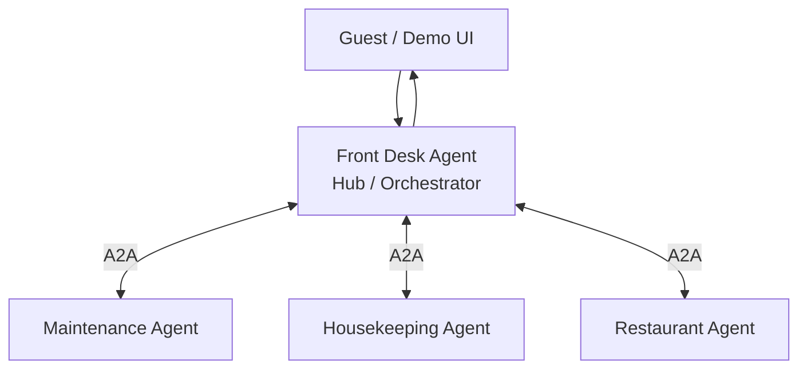

# Hotel A2A Demo 設計書

- 作成日: 2026-10-06
- 状態: 初版設計（未決事項あり）
- プロジェクト指示: [../AGENTS.md](../AGENTS.md)

## 1. 目的と背景

ホテル運営を題材に、独立した部署エージェントがA2A Protocolで協調する様子を体験できるデモを作る。ゲストの依頼をFront Desk Agentが受け取り、担当部署へ委譲し、複数の返答をまとめてゲストへ返す流れを見せる。

本デモの中心は、単一エージェントの能力ではなく、部署ごとに独立したエージェントが公開インターフェースを介して協力する構造と、そのタスクの進行を可視化することにある。

## 2. 決定状況

### 合意済み

- アーキテクチャは **Hub-Spoke** とする。
- Front Desk AgentをHub、部署ごとの専門AgentをSpokeとする。
- Front Desk Agentが部署への依頼を調整し、結果をゲスト向けに集約する。
- 代表シナリオは「部屋のエアコンが故障していて、19時からレストランを予約している」という問い合わせ。
- A2AではAgent同士が内部のツールやメモリを共有せず、独立したサービスとして連携する前提を示す。
- 「対応可能」という提案と、予約変更などの確定操作を区別し、必要なゲスト承認より前に確定しない。

### この設計での初版スコープ案

ユーザーが提示した代表シナリオに合わせて、Front Deskに加え、Maintenance、Housekeeping、Restaurantの3部署を初版の対象とする。ReservationとConciergeは拡張候補とし、初版には含めない。

### 未決事項

- デモの主目的をA2A通信の学習に絞るか、LLMによる依頼解釈・判断も含めるか。
- 初版の部署範囲（上記3部署案でよいか）。
- 実行形態（ローカルWeb、CLI、公開環境）。
- A2Aプロトコルのバージョンとトランスポート。
- デモ内の部署応答を固定シナリオで返すか、LLMや外部データを使うか。
- レストラン予約などの変更をシミュレーションするか、外部システムへ実際に接続するか。

この文書では、未決事項を確定済みとして扱わない。後続実装前に合意し、必要に応じて本文を更新する。

## 3. ドメインモデル

### 用語

| 用語 | 定義 |
|---|---|
| Guest | ホテルに依頼・問い合わせを行う利用者。デモ画面から依頼を送る。 |
| Front Desk Agent | ゲストとの窓口。依頼の整理、部署選択、A2A委譲、返答集約を担う。 |
| Department Agent | 部署固有の能力を公開し、自部署の業務依頼を処理する独立Agent。 |
| Agent Card | Agentの名称、能力、エンドポイント等を相手へ知らせる公開情報。 |
| Task | A2A上で追跡する依頼の処理単位。受付、進行、完了、失敗などの状態を持つ。 |
| Proposal | 部署Agentが返す対応案。確定操作を行う前の提示内容。 |
| Approval | ゲストが提案された変更を承認する操作。承認を要する場合はこれを受けるまで確定しない。 |

### 初版のAgent責務案

| Agent | 責務 | 入力例 | 出力例 |
|---|---|---|---|
| Front Desk | 問い合わせを分解し、部署へ依頼し、結果を集約する | エアコン故障、レストラン予約時刻 | 対応状況とゲスト向け回答 |
| Maintenance | 故障対応の可否、見込み時間、対応状況を返す | 部屋番号、故障内容 | 修理見込み、追加で必要な情報 |
| Housekeeping | 代替部屋や客室対応の可否を返す | 部屋変更の要否、希望条件 | 代替案、空室状況（デモデータ） |
| Restaurant | 予約の照会、時間変更の可否、変更案を返す | 予約時刻、人数、希望時刻 | 変更可否、候補時刻、承認待ち状態 |

各Spokeは自身の業務判断とタスク状態に責任を持つ。他Agentの内部状態やローカルストアを直接参照しない。Agent間で必要な情報はA2Aメッセージとして渡す。

## 4. ユーザーと主要シナリオ

### 対象ユーザー

- A2Aを学びたい開発者、技術者。
- 複数Agentの役割分担、Agent Card、委譲、タスク状態をデモで確認する人。

### 代表シナリオ: 故障対応とレストラン予約

1. ゲストが「部屋のエアコンが壊れていて、19時からレストランも予約しています」とFront Deskへ送る。
2. Front Deskは依頼を、設備対応・代替部屋・レストラン予約の確認に分ける。
3. Front DeskはMaintenance、Housekeeping、Restaurantへ必要な情報だけをA2Aで依頼する。独立して処理できる依頼は並行して送る。
4. 各部署Agentは依頼を受付け、自身のTask状態を進め、結果または追加確認事項を返す。
5. Front Deskは各結果を集約し、対応案、未確定事項、承認が必要な操作を区別してゲストへ説明する。
6. Restaurantの予約変更など承認を要する操作は、ゲストの承認を得てから確定する。実際の外部予約システムに接続しない場合は、デモ上の状態変更として扱う。

### 別パターンとの比較

初版はHub-Spokeを実装する。PipelineやPeer-to-Peerは初版の処理経路に混ぜず、将来的に同一シナリオを使った比較モードとして検討する。

## 5. 要件

### 必須要件（MUST）

1. ゲストが自然文で問い合わせを送信できる。
2. Front Desk Agentが問い合わせを一つ以上の部署向け依頼に整理できる。
3. Front Desk Agentが部署Agentの能力をAgent Card等の公開情報に基づき把握できる。
4. Front Deskと部署AgentがA2A Protocolのメッセージ／タスク機構で通信する。
5. Front Deskから複数の独立した部署へ依頼を委譲できる。
6. 各部署Agentは独立した応答とタスク状態を返す。
7. Front Deskが部署ごとの結果を一つのゲスト向け回答にまとめる。
8. 少なくとも代表シナリオで、Maintenance、Housekeeping、Restaurantへの依頼と結果が追跡できる。
9. 提案と確定操作を区別し、承認を要する変更はゲストの承認前に確定しない。
10. 通信失敗や一部Agentの失敗を、全体の成功と誤認させずに表示・説明する。

### 望ましい要件（SHOULD）

- 画面上でAgent間の依頼・応答とTask状態の変化を時系列に確認できる。
- 各AgentのAgent Cardと担当能力を確認できる。
- 一部Agentが利用できない場合でも、他部署の結果を保持して部分結果を返せる。
- デモを初期状態へ戻し、同じシナリオを再実行できる。

### 初版対象外

- 実在するホテル予約、在庫、設備管理システムへの接続。
- 実際の部屋割り当て、予約変更、請求、決済。
- 認証済みゲストアカウントやホテルの本番運用。
- Reservation Agent、Concierge Agent（拡張候補）。
- PipelineとPeer-to-Peerの実装（比較モードの拡張候補）。

## 6. アーキテクチャ

### Hub-Spoke構成



Front Deskはゲスト要求と全体の進行管理を担当する。各部署Agentは公開されたA2Aインターフェースを持つ独立サービスとして扱う。開発時に単一プロセスへまとめる場合でも、通信境界は維持し、内部関数の直接呼び出しをA2A通信の代用にしない。

### 責務境界

- **UI**: 問い合わせの入力、結果と通信履歴の表示、必要な場合の承認操作。
- **Front Desk Agent**: 問い合わせの解釈、部署への委譲、並行処理の調整、結果集約、ゲストへの返答。
- **Department Agent**: Agent Cardの公開、担当依頼の検証、部署固有の処理、Task状態と結果の返却。
- **デモデータ／アダプター**: 空室や予約候補などの模擬データを提供する。初版では実運用データのソースとして扱わない。

### データと状態の所有

- 各Taskの状態は、そのTaskを処理するAgentが所有する。
- Front Deskは委譲先、Task識別子、状態、返答の要約など、集約に必要な最小情報を保持する。
- 部署間で共用の隠れたメモリを設けない。共有が必要な業務情報は、依頼メッセージに明示して含める。
- 初版は永続化の有無を未決とする。再起動後の履歴保持が必要か、実装前に決める。

## 7. 通信・インターフェース設計

### A2A通信

- Agentは自分の能力をAgent Cardで公開する。
- Front Deskは公開されたカード情報を使って適切な部署Agentを選ぶ。
- Agent間依頼はA2AのメッセージとTaskとして送受信する。
- Taskは受付、実行中、完了、失敗などのプロトコル状態を反映する。
- JSON-RPC等の具体的なトランスポート、仕様バージョン、公式SDK採用は未決。採用前にA2A公式仕様とSDK資料を参照して確定する。

### 部署Agentの論理インターフェース

各AgentはA2A共通の通信形式を使い、業務上の意味はメッセージ本文で表す。

```json
{
  "requestType": "check_availability",
  "guestRequest": "エアコン故障のため代替部屋が必要か確認したい",
  "context": {
    "room": "デモ用の客室",
    "requestedAt": "デモシナリオの時刻"
  }
}
```

上記は業務ペイロードの例であり、A2Aプロトコルの確定スキーマではない。実際のA2Aバージョンに合わせてメッセージ形式を決定する。

### 部署Agent応答の意味モデル

部署の応答は少なくとも次の情報を表現できるようにする。

- 結果種別: 対応可能、対応不可、追加情報が必要、提案、失敗。
- 人間が読める説明。
- 任意の候補または見込み時間。
- 確定操作の有無とゲスト承認の要否。
- A2A Taskの識別子と状態。

## 8. 処理制御と失敗時の振る舞い

### オーケストレーション

- Front Deskが問い合わせを分析し、必要な部署を選択する。
- 他の結果を待たずに実行できる依頼は並行して送る。
- ある部署の結果が別部署の依頼条件を決める場合は、依存関係を明示して順次実行する。
- 全応答または設定した待機期限まで待ち、成功・失敗・未応答を含めて集約する。
- 一部失敗時は部分結果として返し、未完了の担当を明示する。成功していない処理を成功と報告しない。

### エラー分類

| エラー | 振る舞い |
|---|---|
| 入力不足・解釈不能 | Front Deskが追加質問を返し、推測で変更を確定しない。 |
| Agent Card取得失敗 | 対象Agentを利用できない旨を記録し、他の部署への依頼を続けられる場合は続ける。 |
| 部署Agentの拒否・業務上不可 | 業務上の不可として結果に含め、システム障害と区別する。 |
| 通信タイムアウト | 対象Taskを未完了／失敗として示す。再試行を実装する場合は重複実行を防ぐ。 |
| Agent内部エラー | エラー詳細を利用者へ露出せず、担当部署の処理失敗として示す。 |
| ゲストによる提案拒否 | 提案を確定せず、その選択をFront Deskへ返す。 |

タイムアウト値、再試行回数、バックオフ、重複排除キーは未決。副作用のある処理に自動再試行を適用する場合は冪等性を設計する。

## 9. UI仕様案

ローカルWebデモを採用する場合の画面案。実行形態は未決。

1. 問い合わせ入力欄と代表シナリオのサンプル入力。
2. Front Deskおよび各部署Agentの名称・能力・接続状態。
3. 時系列の通信履歴（依頼先、依頼内容の要約、応答、Task状態）。
4. 部署ごとの結果カードと、Front Deskによる最終回答。
5. 提案に承認が必要な場合の承認／拒否操作。
6. 一部Agentが失敗した場合の部分結果と失敗表示。

実装時は、Guestに見せる業務回答と、学習者向けのA2A通信詳細を区別して表示する。

## 10. 非機能要件

### セキュリティ・プライバシー

- デモ用データは架空のものとし、実在ゲストの個人情報を含めない。
- Agent間には担当処理に必要な情報だけを渡す。
- 秘密情報はソース、サンプル、ログへ記録しない。
- 外部アクセスを公開する場合の認証、TLS、認可、レート制限は公開前に別途設計する。本書ではローカル実行を前提にした場合の保護範囲を定義していない。
- 実際の予約変更などの外部副作用を加える場合は、承認、認可、監査ログ、冪等性を追加設計する。

### 性能・可用性

- 性能数値、同時ユーザー数、可用性目標はデモの実行形態が決まっていないため未設定。
- 複数部署への独立依頼は並行実行し、1部署の遅延が他部署の応答を不要に遅らせない。
- 本番運用、冗長化、バックアップ、RTO/RPOは初版スコープ外。

### 保守性

- Front Deskと部署Agentの責務を分離する。
- Agent追加時に既存Agentの内部実装変更を最小化し、Agent Cardと公開A2Aインターフェースを接続境界にする。
- プロトコルバージョンや外部仕様に依存する実装は、業務ルールから分離する。

## 11. 開発・検証方針

### 検証観点

- Agent CardからAgentの能力と接続先を発見できる。
- Front Deskが問い合わせを複数の部署へ適切に振り分けられる。
- 並行する部署Taskの状態と結果を正しく集約できる。
- 部署の失敗・タイムアウトを部分結果として扱える。
- ゲスト承認前に予約変更等の確定状態へ遷移しない。
- 各Agentが独立しており、内部状態を直接共有しなくても連携できる。
- 代表シナリオを画面またはクライアントから最後まで確認できる。

具体的なテスト技術、CI実行条件、カバレッジ目標は後続の実装計画で定める。

### ローカル実行・運用

- 起動コマンド、Agentごとのポート、環境変数、停止方法は実行方式決定後に定める。
- ログはAgent名、Task識別子、状態遷移を追えるようにし、ゲストの不要な個人情報を含めない。
- 開発時のバックグラウンドAgentプロセスは明示的に起動・停止できるようにする。

## 12. 技術選定

### 決定済み

- 言語: Python 3.13
- エージェントフレームワーク: Google Agent Development Kit（ADK）
- 依存管理・仮想環境: `uv`
- ADKのA2A機能: `google-adk[a2a]` を利用する。

選定理由と一次情報は [ADR 0001](adr/0001-python-adk.md) を参照。

### 未決

- A2Aプロトコルバージョンとトランスポート。
- UI方式、永続化、LLMプロバイダー、コンテナ化。

プロトコルのバージョン、Agent Card、Task API、トランスポートは、実装前に公式資料を確認して固定する。

## 13. 受け入れ条件

- [ ] ゲストが代表シナリオの問い合わせを送信できる。
- [ ] Front Desk AgentがMaintenance、Housekeeping、RestaurantへA2A依頼を行う。
- [ ] 各部署Agentの独立したTaskと応答が確認できる。
- [ ] Front Deskが返答を集約し、成功・提案・未完了を区別してゲストへ返す。
- [ ] 予約変更など承認が必要な操作は、承認前に確定されない。
- [ ] 1部署が利用できない場合、他部署の結果を失わず部分結果として扱える。
- [ ] A2A Agent Cardとメッセージ／Taskのプロトコル仕様が、採用する公式仕様に準拠している。

## 14. 参照

- A2A Protocol公式仕様: <https://a2aproject.github.io/A2A/latest/specification/>（2026-10-06確認）
- A2A Python SDK公式リポジトリ: <https://github.com/a2aproject/a2a-python>（2026-10-06確認）
- これらの情報は候補技術の調査に使用した。プロトコルバージョンおよびSDK採用は未決。
